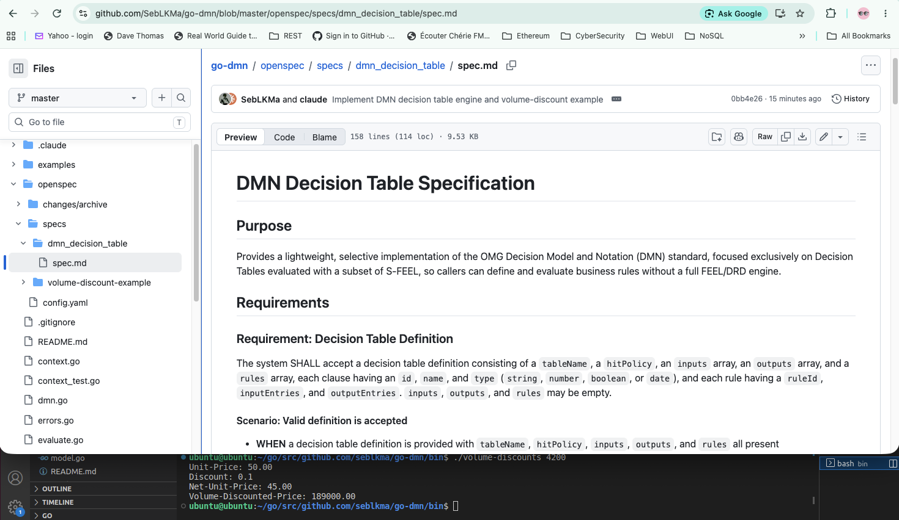
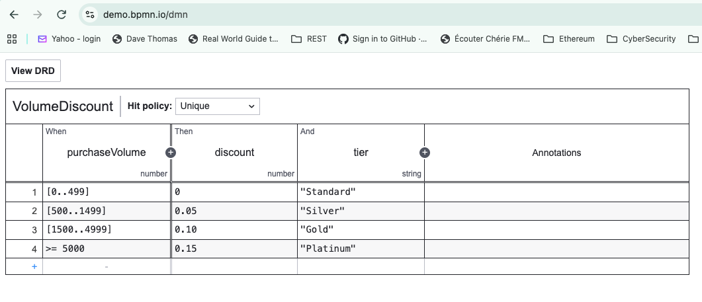

# go-dmn
Selective implementation of the DMN standard

## Getting started OpenSpec with Claude

```sh
cd your-project
openspec init --tools claude
```

Subsequently, just
```sh
openspec init
```

```sh
openspec-propose <The spec directory name>
```

```sh
openspec-apply
```

```sh
openspec-archive
```
This ends fo the implementation first spec.

From here on, the cycle continues:  
`openspec-propose <new features...>` -> `openspec-apply` -> `openspec-archive`

## Volume discounts example



## Visual Rule Editor
To view or modify, load the `.dmn` file into `https://demo.bpmn.io/dmn`.  




## Prompts

1. `/openspec-propose`
2. `/opsx:propose`
3. `/openspec-propose dmn_decision_table`
4. `Use Golang to implement`
5. `openspec-apply`
6. `openspec-archive`
7. `/openspec-propose Based on the sample contract clause in @examples/volume-discounts/contract-clause.md, in this directory create a DMN file and a Go program that accepts the purchase-volume as input arguument. Use our dmn_decision_table implementation to evaluate the DMN file. The output will show the Unit-Price, Discount, Net-Unit-Price, Volume-Discounted-Price`
8. `openspec-apply`
9. `openspec-archive`
10. `List all previous prompts in the README.md "Prompts" section`
